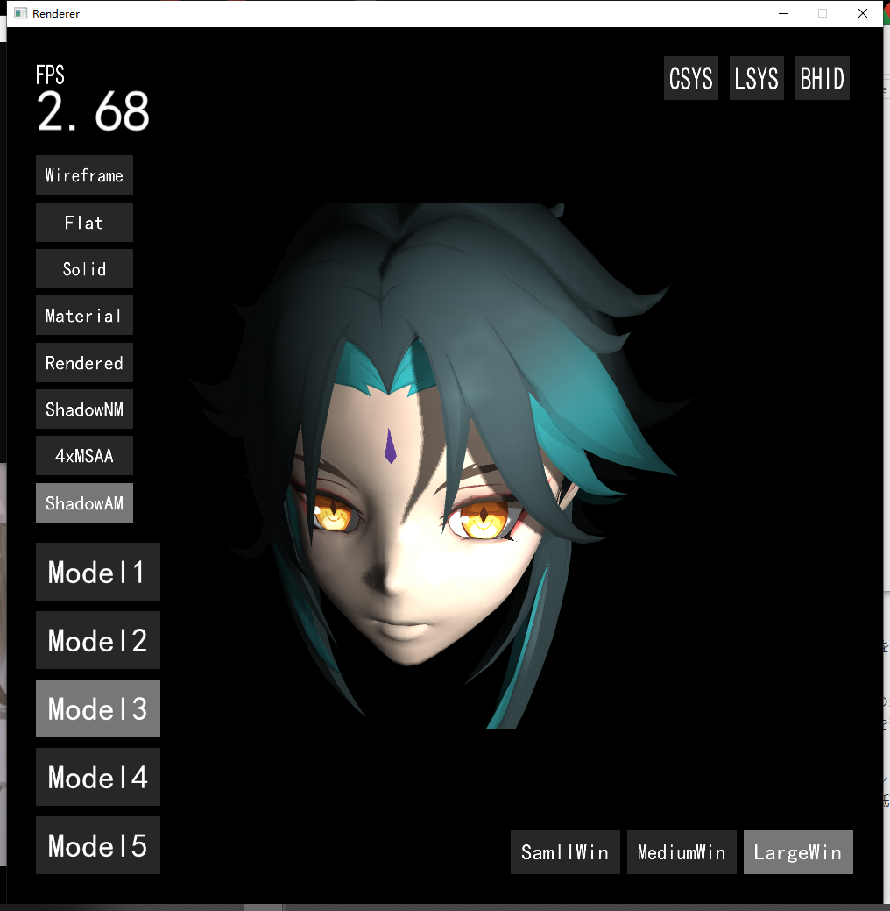

# 説明書_日本語

これらは私が行った2つのレンダラープロジェクトです。.exeファイルとソースコードを提供しています。ご覧ください。

---

### 1. Raytracer

[ssloy](https://github.com/ssloy/tinyraytracer)のプロジェクトに基づいており、Whitted-Styleのレイトレーシングを実装しています。

プログラミング言語：C++。

開発期間：1ヶ月。

Raytracer_srcフォルダにソースコードが含まれています。

Releaseフォルダには.exeファイルが含まれており、Releaseフォルダ全体をダウンロードしてください。.exeファイルを実行すると、outフォルダにレンダリングされたPPM画像が生成されます。以下は私が生成したいくつかのレンダリング結果です。

### 2. Rasterizer

コンピュータグラフィックスを勉強するために、このプロジェクトを実装しました。基本的なレンダリングパイプライン、MSAAアンチエイリアス、シャドウマップなどを実装しました。

このプロジェクトを開発する前、私はCしか知らず、C++を学んだことがなかったため、このプロジェクトは基本的にCをベースにしたプロセス指向の開発である。プロジェクトの後半になると、コードが非常に混乱していることがわかり、これがこのプロジェクトを開発する際に得られた最も深い経験です。

プログラミング言語：C/C++。
開発期間：3ヶ月。

Rasterizer_srcフォルダにソースコードが含まれています。

Releaseフォルダには.exeファイルが含まれており、Releaseフォルダ全体をダウンロードしてください。.exeファイルを実行してください。

左下の「Model」ボタンでモデルを切り替えることができ、その上の一連のボタンでレンダリングモードを切り替えることができます。右下のボタンでウィンドウのサイズを変更でき、右上のボタンで座標軸や光源の位置などを表示できます。

また、キーボードとマウスで第一人称カメラを制御することができます。

ファセットが多いモデルをレンダリングし、アンチエイリアスやシャドウレンダリングをオンにすると、コンピュータのパフォーマンスが大幅に低下し、フレームレートが低下することに注意してください。

