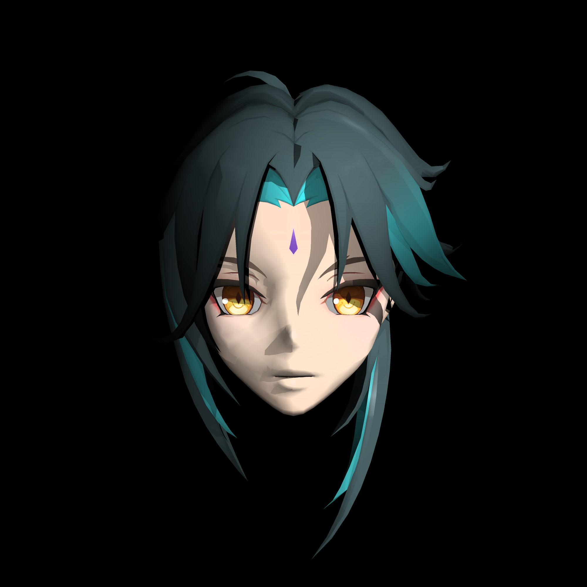
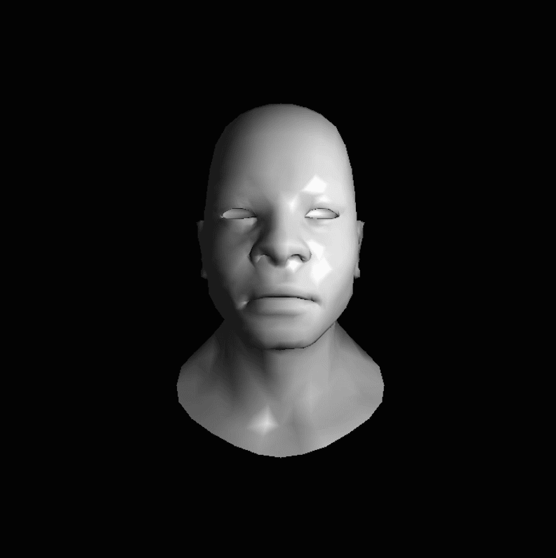
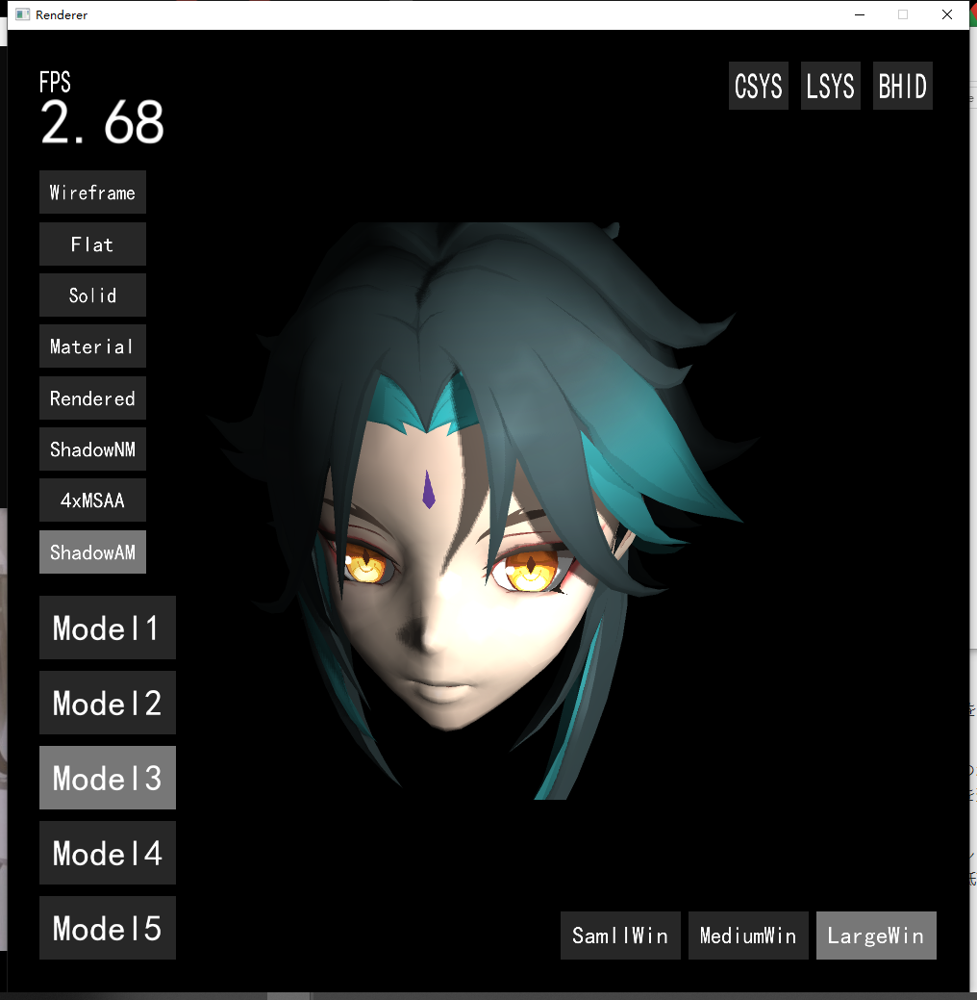

# 说明文档

这是我为了学习计算机图形学，用 C/C++ 做过的两个简单的渲染器。我提供了可执行文件和源码，请查看。

※ 我只提供了最基本的源码文件，考虑到各种外部库的依赖和程序渲染所需要的 .obj 模型文件体积过大的因素，所以我并未提供 .sln 工程文件，请见谅。

---

### 1. Raytracer

为了学习光线追踪的思想，根据 [ssloy](https://github.com/ssloy/tinyraytracer) 的 Github 教程，编程实现的一个 Whitted-Style 光线追踪渲染器（基于 CPU）。

编程语言：C/C++

开发时间：1个月

在 Raytracer 文件夹里的 Raytracer_src 文件夹中存有该项目的源代码。

在 Raytracer 文件夹里的 Release 文件夹中存有可执行文件。请将 Release 文件夹里的文件全部下载后，执行可执行文件，将会在 out 文件夹下生成一张 PPM 格式的渲染图像。下面是我生成的 2 张渲染结果：

### 2. Rasterizer

在大学四年级的时候，为了学习计算机图形学，将毕业设计的主题设定为了编程实现一个软光栅渲染器。

该渲染器是基于 CPU 的光栅化渲染器，完成了基础的渲染管线、MSAA 抗锯齿、阴影贴图等功能。本项目是以学习为目的开发的，所以是在不引入图形库的情况下从零开始编程实现的一个渲染器，其中还包括了对 .obj 模型文件的封装和简单的 GUI 的设计与实现。

开发本项目时，本人并不会 C++，所以本项目主要是以面向过程的编程思想开发的。导致了开发后期代码的混乱局面，这是通过本项目的开发得到的最深的体会。

编程语言：C/C++

开发时间：3个月

在 Rasterizer 文件夹里的 Rasterizer_src 文件夹中存有该项目的源代码。

在 Rasterizer 文件夹里的 Release 文件夹中存有可执行文件。请将 Release 文件夹里的文件全部下载后，执行可执行文件。

见上图：左下角的 Model 按钮可以切换渲染的模型，其上方的一系列按钮可以切换渲染模式，屏幕右下角的按钮可以切换窗口大小，右上角的按钮可以显示一些坐标轴、光源位置等辅助信息。

另外，通过键盘和鼠标可以控制第一人称摄像机。见下图：

渲染高面数物体时，或者同时打开阴影生成和抗锯齿等功能时，会极大消耗处理器资源，请注意。

